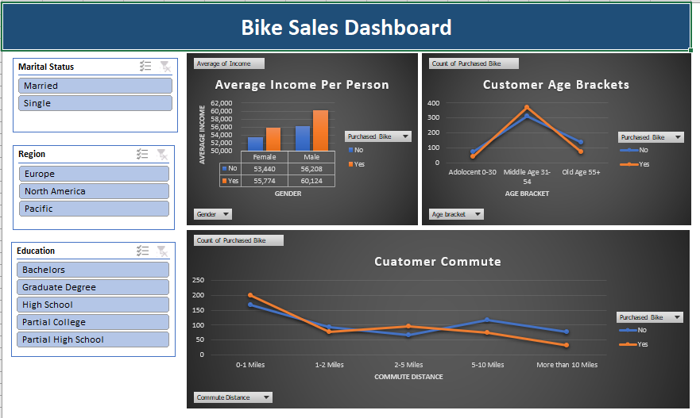

## Excel Sales Dashboard

### Objective
Analyze bike sales data to identify trends and key performance metrics.

### Tools Used
- Microsoft Excel
- Pivot Tables
- Charts
- Data Cleaning

### Key Insights
- Identified top-performing regions
- Analyzed Age group sales trends
- Compared Genderwise revenue

### Files
- Bike_Sales_Dashboard.xlsx – Interactive dashboard
- 
## Dashboard Preview

